# AWS VPC Introduction Lab

<div align="center">
  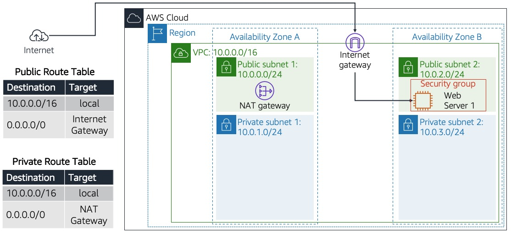
</div>

---

## Overview

This Lab covers the following steps:

- **VPC Creation**: Create a VPC with a CIDR block.
- **Subnet Creation**: Set up public and private subnets.
- **Internet Gateway Setup**: Attach an Internet Gateway to the VPC.
- **NAT Gateway Setup**: Create a NAT Gateway for private subnet internet access.
- **Route Tables Configuration**: Configure route tables for public and private subnets.
- **Security Groups Configuration**: Set rules to allow HTTP traffic.
- **Web Server Deployment**: Launch an EC2 instance with a web server and associate an Elastic IP.
- **Resource Cleanup**: Terminate resources to avoid charges.

---  
⚠️ **Attention**: 
1. All the tasks will be completed via the command line using AWS CLI. [AWS CLI Install](https://docs.aws.amazon.com/cli/latest/userguide/getting-started-install.html)
2. Please be aware that charges may apply while completing this lab. [AWS Pricing](https://aws.amazon.com/pricing/)

---

## Step 1 - VPC Creation
#### 1.1. To create a VPC with the CIDR block 10.0.0.0/16:
```bash
aws ec2 create-vpc \
	--cidr-block 10.0.0.0/16 \
	--tag-specifications 'ResourceType=vpc,Tags=[{Key=Name,Value=LabVPC}]'
```
Save the VPC ID returned in the output.

#### 1.2. To check the status of the VPC:
```bash
aws ec2 describe-vpcs --vpc-ids <VPC_ID> --query "Vpcs[*].State"
```

<div align="center">
  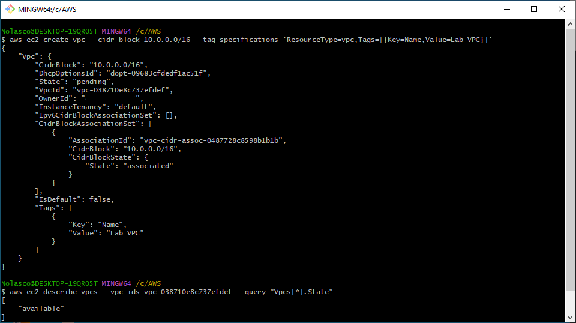
</div>

## Step 2 - Subnet Creation
#### 2.1. To list Availability Zones:
```bash
aws ec2 describe-availability-zones --query "AvailabilityZones[*].ZoneName" --output text
```
#### 2.2. Create a public subnet in Availability Zone A:
```bash
aws ec2 create-subnet \
	--vpc-id <VPC_ID> \
	--cidr-block 10.0.0.0/24 \
  	--availability-zone <AZ_A> \
  	--tag-specifications 'ResourceType=subnet,Tags=[{Key=Name,Value=Public Subnet 1}]'
```
#### 2.3. Create a private subnet in Availability Zone A:
```bash
aws ec2 create-subnet \
	--vpc-id <VPC_ID> \
	--cidr-block 10.0.1.0/24 \
	--availability-zone <AZ_A> \
	--tag-specifications 'ResourceType=subnet,Tags=[{Key=Name,Value=Private Subnet 1}]'
```

<div align="center">
  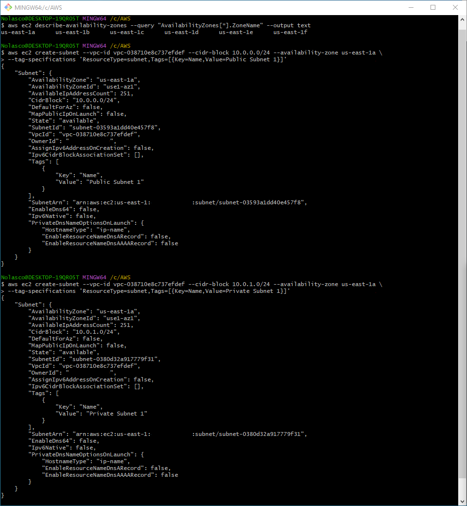
</div>

#### 2.4. Create a public subnet in Availability Zone B:
```bash
aws ec2 create-subnet \
	--vpc-id <VPC_ID> \
	--cidr-block 10.0.2.0/24 \
	--availability-zone <AZ_B> \
	--tag-specifications 'ResourceType=subnet,Tags=[{Key=Name,Value=Public Subnet 2}]'
```
#### 2.5. Create a private subnet in Availability Zone B:
```bash
aws ec2 create-subnet \
	--vpc-id <VPC_ID> \
	--cidr-block 10.0.3.0/24 \
	--availability-zone <AZ_B> \
	--tag-specifications 'ResourceType=subnet,Tags=[{Key=Name,Value=Private Subnet 2}]'
```

<div align="center">
  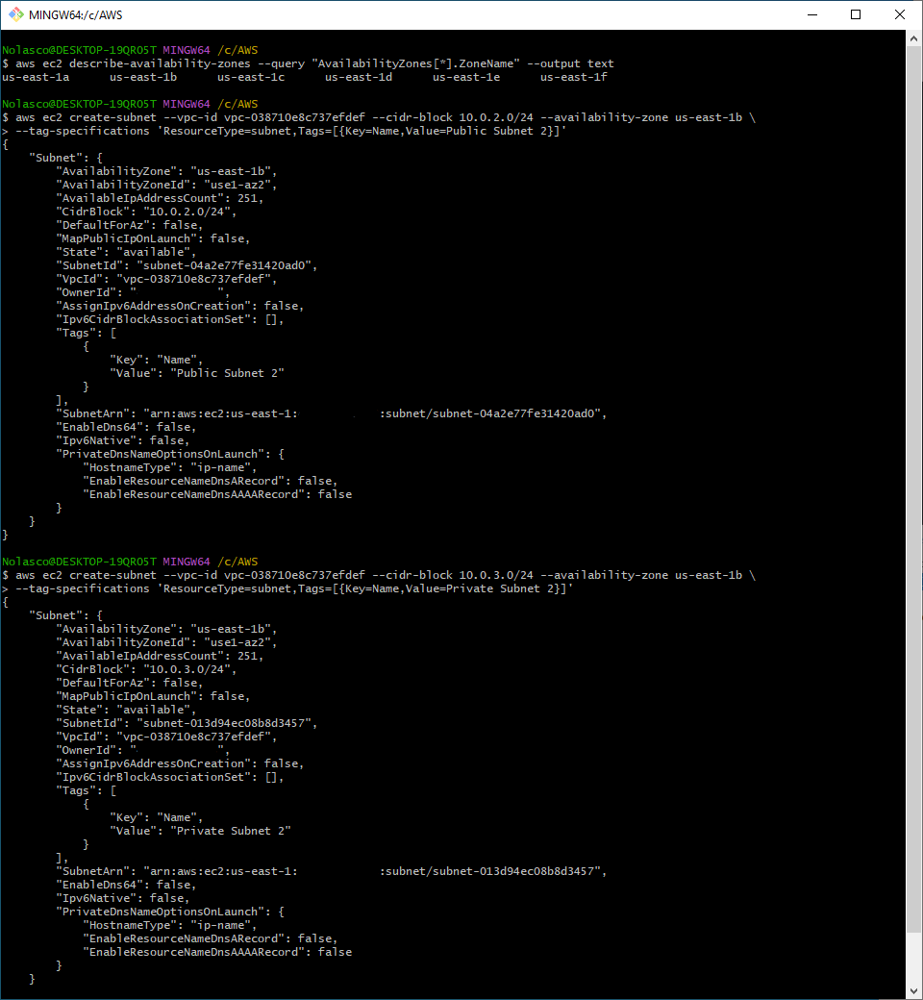
</div>

#### 2.6. Retrieve the subnets IDs:
```bash
aws ec2 describe-subnets \
	--filters "Name=vpc-id,Values=VPC_ID" \
	--query "Subnets[*].[SubnetId, Tags[?Key=='Name'].Value | [0]]" \
	--output table
```

<div align="center">
  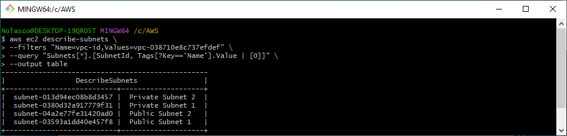
</div>

## Step 3 - Internet Gateway Setup
#### 3.1. Create the Internet Gateway:
```bash
aws ec2 create-internet-gateway \
	--tag-specifications 'ResourceType=internet-gateway,Tags=[{Key=Name,Value=LabIGW}]'
```
Save the Internet Gateway ID returned in the output.

#### 3.2. Attach the Internet Gateway to the VPC:
```bash
aws ec2 attach-internet-gateway \
	--vpc-id <VPC_ID> \
	--internet-gateway-id <IGW_ID>
```
#### 3.3. To verify the Internet Gateway status:
```bash
aws ec2 describe-internet-gateways --internet-gateway-ids <IGW_ID> --query "InternetGateways[*].Attachments"
```

<div align="center">
  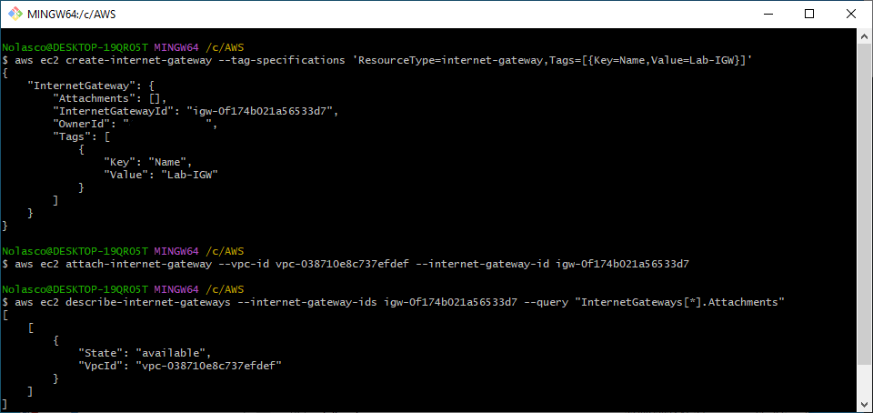
</div>

## Step 4 - NAT Gateway Setup
#### 4.1. Allocate an Elastic IP to your Account:
```bash
aws ec2 allocate-address --domain vpc
```
Save the PublicIp and the AllocationId returned in the output.

<div align="center">
  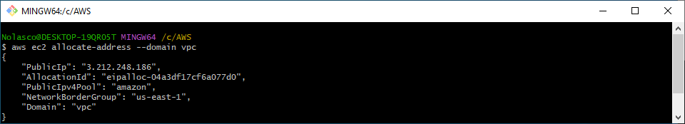
</div>

#### 4.2. Create a NAT gateway in the public subnet (Availability Zone A):
```bash
aws ec2 create-nat-gateway \
	--subnet-id <PUBLIC_SUBNET_1_ID> \
	--allocation-id <ALLOCATION_ID>
```

Save the NAT gateway ID returned in the output.

<div align="center">
  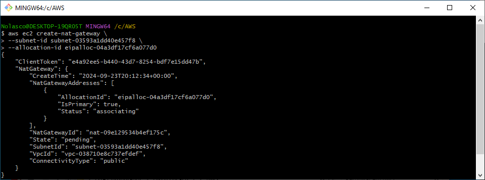
</div>

## Step 5 - Route Tables Configuration
#### 5.1. Create a route table for public subnets:
```bash
aws ec2 create-route-table \
	--vpc-id <VPC_ID> \
	--tag-specifications 'ResourceType=route-table,Tags=[{Key=Name,Value=Public Route Table}]'
```

Save the Public Route Table ID returned in the output.

<div align="center">
  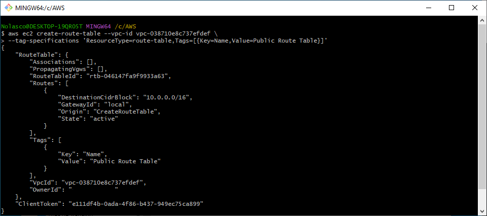
</div>

#### 5.2. Create a route to the Internet Gateway for the public route table:
```bash
aws ec2 create-route \
	--route-table-id <PUBLIC_RT_ID> \
	--destination-cidr-block 0.0.0.0/0 \
	--gateway-id <IGW_ID>
```

<div align="center">
  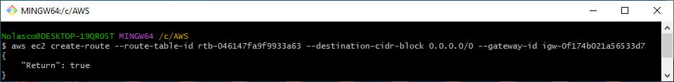
</div>

#### 5.3. Associate the public route table with public subnets:
```bash
aws ec2 associate-route-table --subnet-id <PUBLIC_SUBNET_1_ID> --route-table-id <PUBLIC_RT_ID> 
aws ec2 associate-route-table --subnet-id <PUBLIC_SUBNET_2_ID> --route-table-id <PUBLIC_RT_ID>
```

<div align="center">
  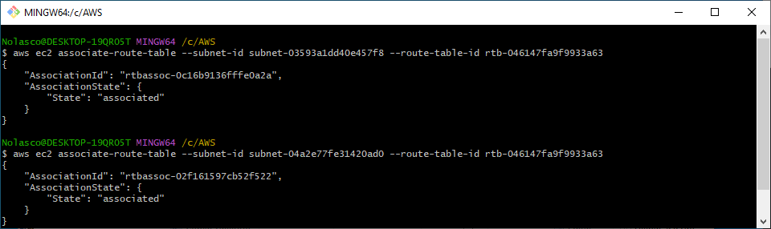
</div>

#### 5.4. Create a route table for private subnets:
```bash
aws ec2 create-route-table \
	--vpc-id <VPC_ID> \
	--tag-specifications 'ResourceType=route-table,Tags=[{Key=Name,Value=Private Route Table}]'
```

Save the Private Route Table ID returned in the output.

<div align="center">
  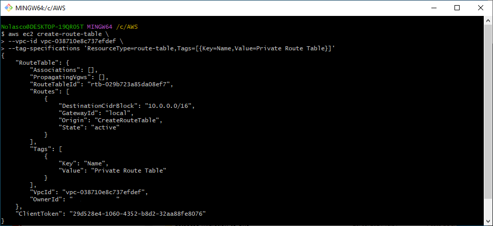
</div>

#### 5.5. Create a route to the NAT gateway for the private route table:
```bash
aws ec2 create-route \
	--route-table-id <PRIVATE_RT_ID> \
	--destination-cidr-block 0.0.0.0/0 \
	--nat-gateway-id <NAT_GW_ID>
```

<div align="center">
  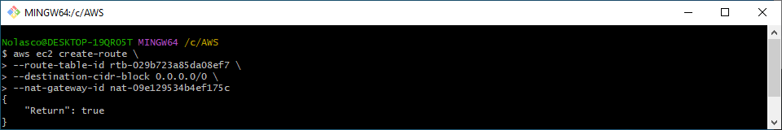
</div>

#### 5.6. Associate the private route table with private subnets:
```bash
aws ec2 associate-route-table --subnet-id <PRIVATE_SUBNET_1_ID> --route-table-id <PRIVATE_RT_ID> 
aws ec2 associate-route-table --subnet-id <PRIVATE_SUBNET_2_ID> --route-table-id <PRIVATE_RT_ID>
```

<div align="center">
  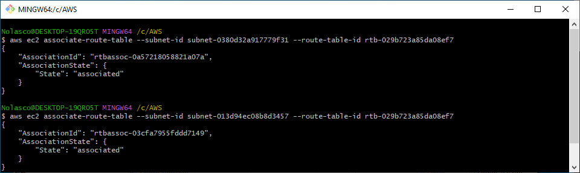
</div>

## Step 6 - Security Groups Configuration
#### 6.1. Create a security group for the web server:
```bash
aws ec2 create-security-group \
	--group-name web-server-sg \
	--description "Web Server Security Group" \
	--vpc-id <VPC_ID>
```

Save the Security Group ID returned in the output.

<div align="center">
  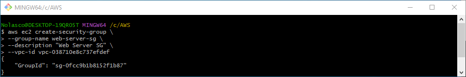
</div>

#### 6.2. Allow inbound traffic on port 80 (HTTP):
```bash
aws ec2 authorize-security-group-ingress --group-id <SG_ID> --protocol tcp --port 80 --cidr 0.0.0.0/0
```

<div align="center">
  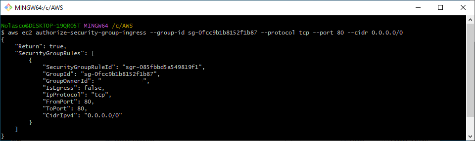
</div>

## Step 7 - Web Server Deployment
#### 7.1. Launch the web server instance in Public Subnet 2:
```bash
aws ec2 run-instances \
	--image-id <AMI_ID> \
	--instance-type t2.micro \
	--associate-public-ip-address \
	--security-group-ids <SG_ID> \
	--subnet-id <PUBLIC_SUBNET_2_ID> \
	--user-data file://install-webserver.sh
```

Save the ec2 Instance ID returned in the output.

<div align="center">
  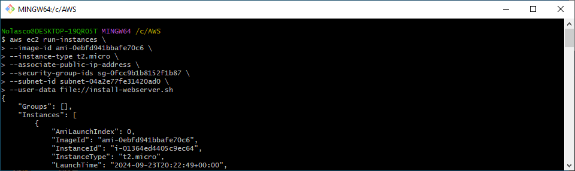
</div>

#### 7.2. Retrieve the instance's IPv4 Public Address and test the web server:
```bash
aws ec2 describe-instances --instance-ids <INSTANCE_ID> \
	--query "Reservations[*].Instances[*].PublicIpAddress" --output text
```

<div align="center">
  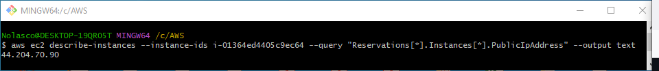
</div>

#### 7.3. Visit http://<INSTANCE_PUBLIC_IP> to verify the web server is running.

<div align="center">
  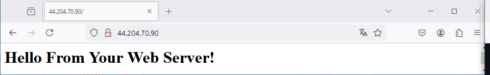
</div>

#### 7.4. Allocate a new Elastic IP to your Account:
```bash
aws ec2 allocate-address --domain vpc
```
Save the PublicIp and the AllocationId returned in the output.

#### 7.5. Associate the Elastic IP obtained in the last step to the EC2 instance and test the web server:
```bash
aws ec2 associate-address \
	--instance-id <INSTANCE_ID> \
	--allocation-id <ALLOCATION_ID>
```

<div align="center">
  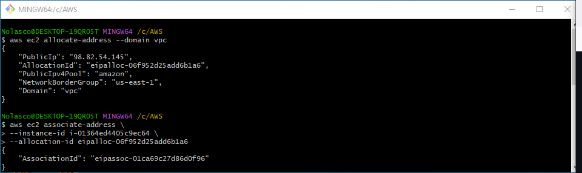
</div>

#### 7.6. Visit http://<INSTANCE_PUBLIC_IP> to verify the web server is running.

<div align="center">
  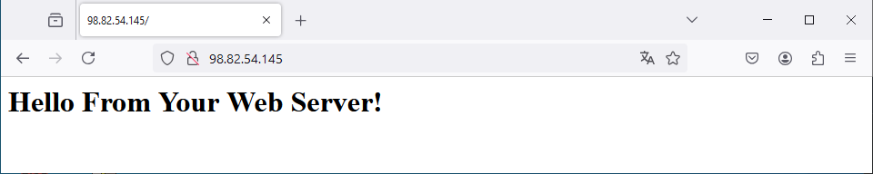
</div>

#### Content of `install-webserver.sh`:
```bash
#!/bin/bash
# Installs the Apache web server            
yum -y install httpd
# Configures httpd to start on boot      
systemctl enable httpd
# Starts the httpd service now    
systemctl start httpd
# Creates an HTML homepage
echo '<html><h1>Hello From Your Web Server!</h1></html>' > /var/www/html/index.html 
```

## Step 8 - Resource Cleanup
#### 8.1. Terminate the EC2 instance:
```bash
aws ec2 terminate-instances --instance-ids <INSTANCE_ID>
```

<div align="center">
  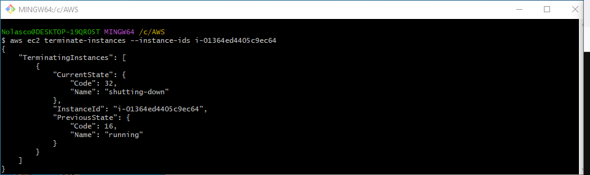
</div>

#### 8.2. Delete NAT Gateway
```bash
aws ec2 delete-nat-gateway --nat-gateway-id <NAT_GATEWAY_ID>
```

<div align="center">
  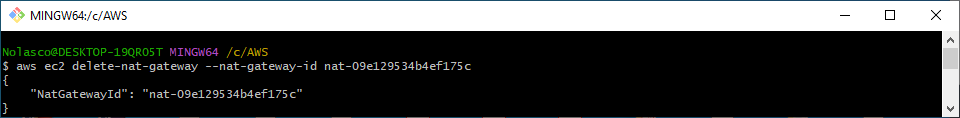
</div>

#### 8.3. Detach and Delete Internet Gateway
```bash
aws ec2 detach-internet-gateway --internet-gateway-id <IGW_ID> --vpc-id <VPC_ID>
aws ec2 delete-internet-gateway --internet-gateway-id <IGW_ID>
```

#### 8.4. Release the Elastic IP:
```bash
aws ec2 release-address --allocation-id <ALLOCATION_ID>
```

#### 8.5. Delete VPC
```bash
aws ec2 delete-vpc --vpc-id <VPC_ID>
```

<div align="center">
  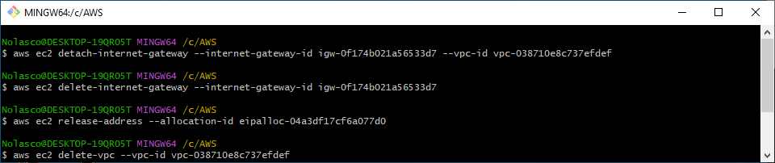
</div>
