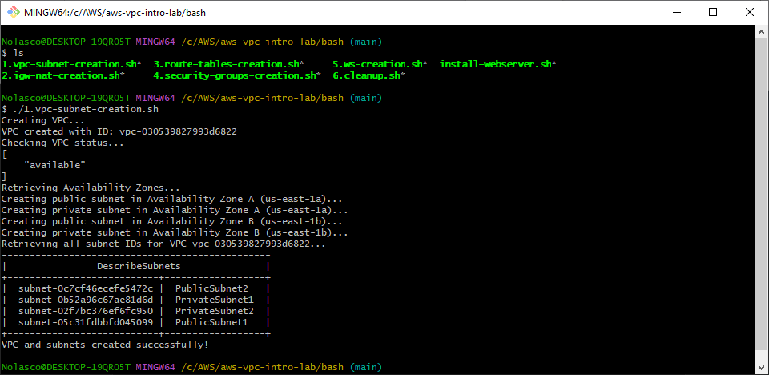
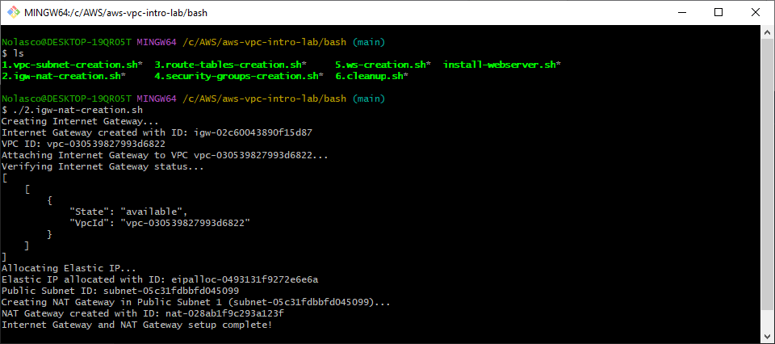
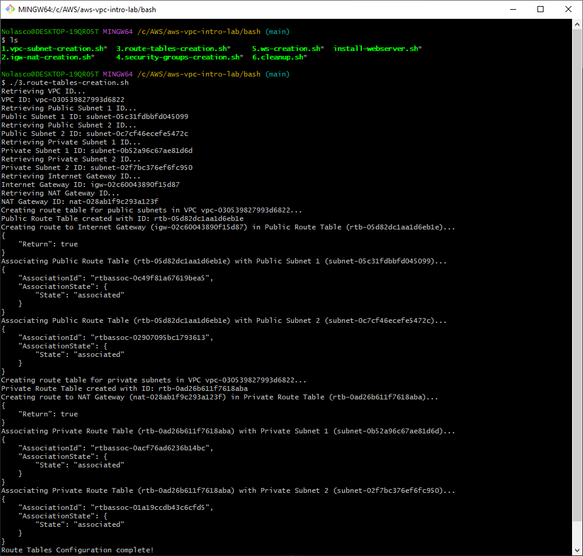
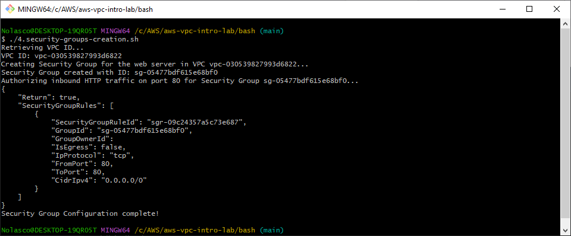
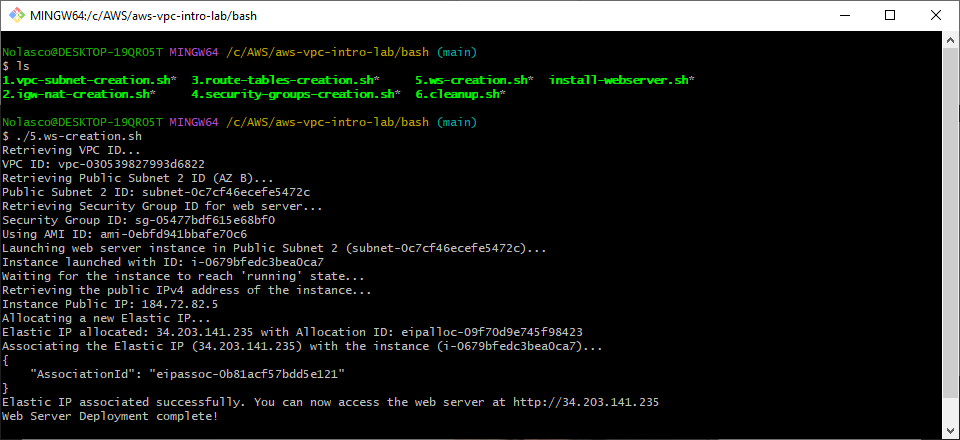

## Overview
You can execute these scripts as an alternative to manual resource creation in the AWS Management Console. 

## Execution Order

Please run the scripts in the following order:
- Edit the scripts according to your needs before running them

1. **Create VPC and Subnets**
```bash
./vpc-subnet-creation.sh
```

<div align="center">
  
</div>

---

2. **Create Internet Gateway and NAT Gateway**
```bash
./igw-nat-creation.sh
```

<div align="center">
  
</div>

---

3. **Create Route Tables**
```bash
./route-tables-creation.sh
```

<div align="center">
  
</div>

---

4. **Create Security Groups**
```bash
./security-groups-creation.sh
```

<div align="center">
  
</div>

---

5. **Launch Web Servers**
```bash
./ws-creation.sh
```

<div align="center">
  
</div>

---

6. **Cleanup Resources:
- After you have finished using the resources, you can run the cleanup script to delete everything**
```bash
./cleanup.sh
```

<div align="center">
  
</div>
