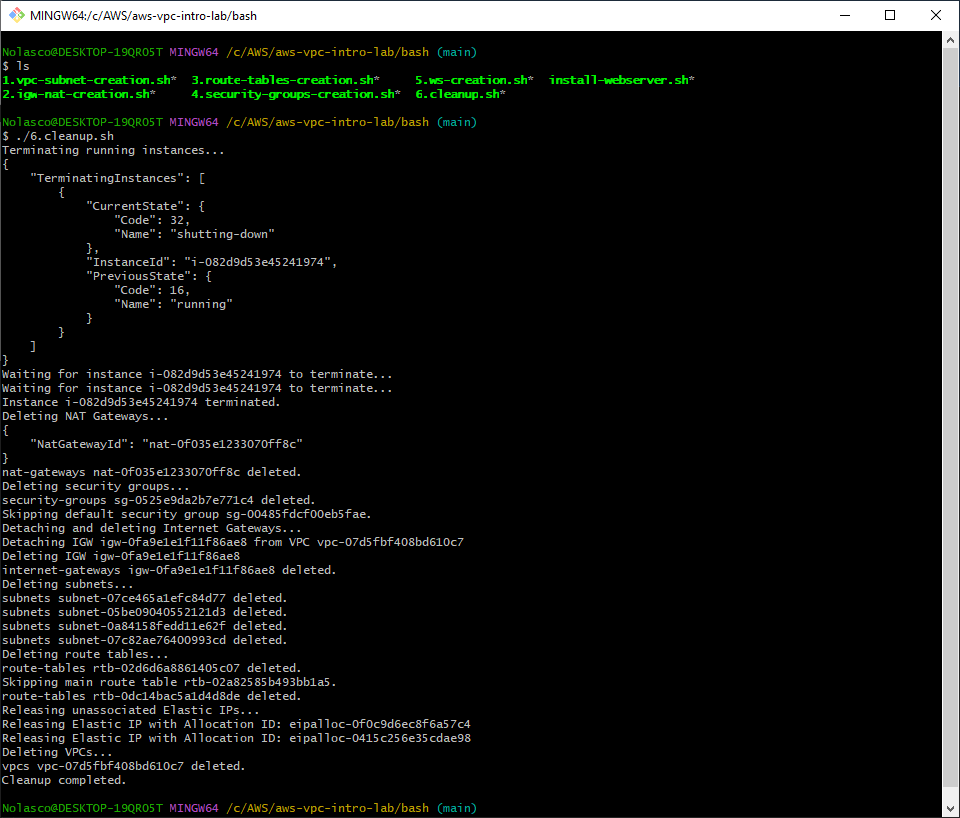

## Overview
You can execute these scripts as an alternative to manual resource creation in the AWS Management Console. 

## Execution Order

Please run the scripts in the following order:
- Edit the scripts according to your needs before running them

1. **Create VPC and Subnets**
```bash
./vpc-subnet-creation.sh
```

<div align="center">
  
</div>

---

2. **Create Internet Gateway and NAT Gateway**
```bash
./igw-nat-creation.sh
```

<div align="center">
  
</div>

---

3. **Create Route Tables**
```bash
./route-tables-creation.sh
```

<div align="center">
  
</div>

---

4. **Create Security Groups**
```bash
./security-groups-creation.sh
```

<div align="center">
  
</div>

---

5. **Launch Web Servers**
```bash
./ws-creation.sh
```

<div align="center">
  
</div>

---

6. **Cleanup Resources**
- After you have finished using the resources, you can run the cleanup script to delete everything
```bash
./cleanup.sh
```

<div align="center">
  
</div>

---

## Conclusion
In Task 6, when attempting to detach and delete the Internet Gateway (IGW) right after deleting the NAT Gateway, I encountered a permission error. This happened because there’s a slight delay before the NAT Gateway is fully removed. To resolve this, instead of deleting the IGW immediately, I reordered the sequence of commands: after the NAT Gateway was deleted, I inserted the deletion of other resources (such as security groups) before calling the command to remove the IGW. While other approaches, such as loops, sleep commands, or additional checks, could have been applied, this reordering proved to be the simplest and most effective solution.

- Error before reordering

<div align="center">
  
</div>
